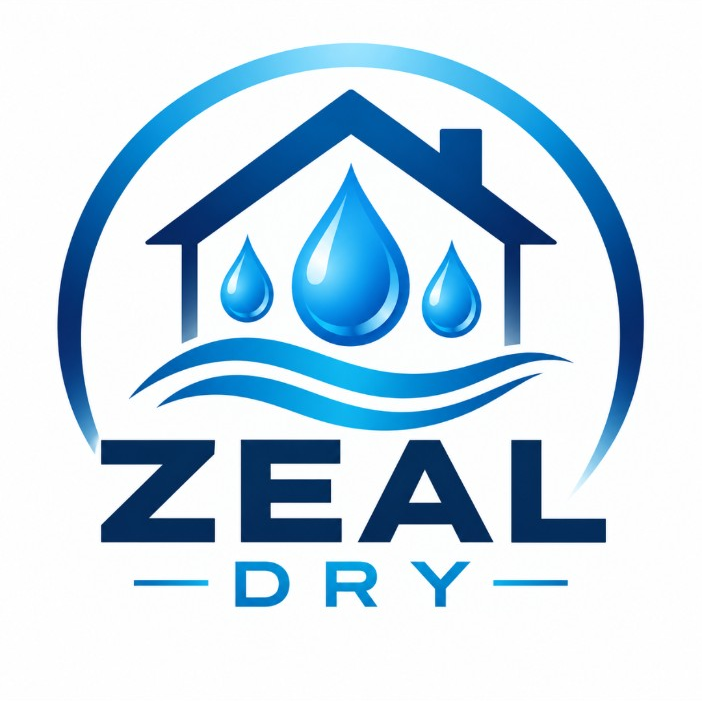
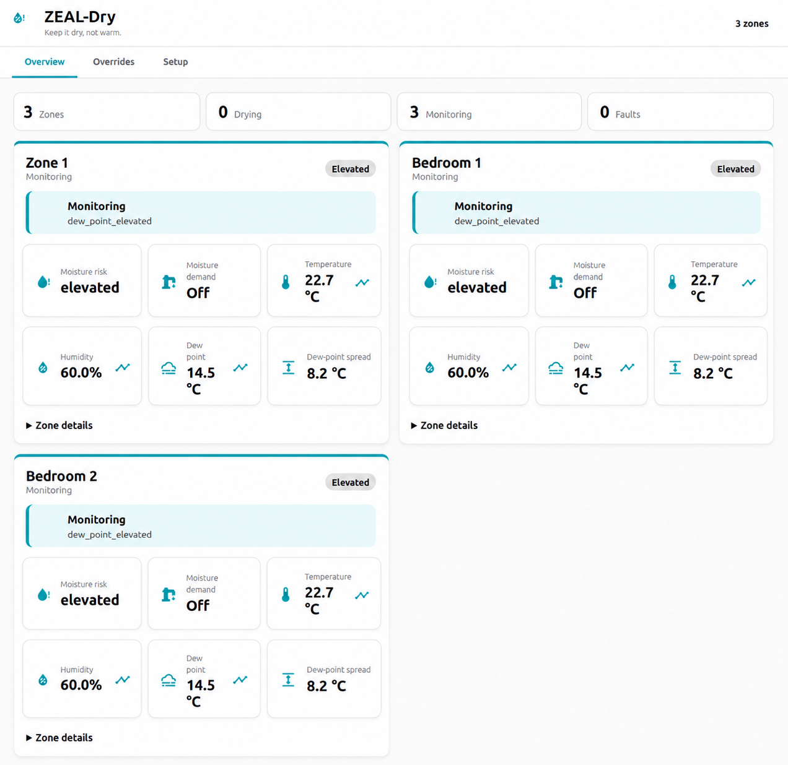
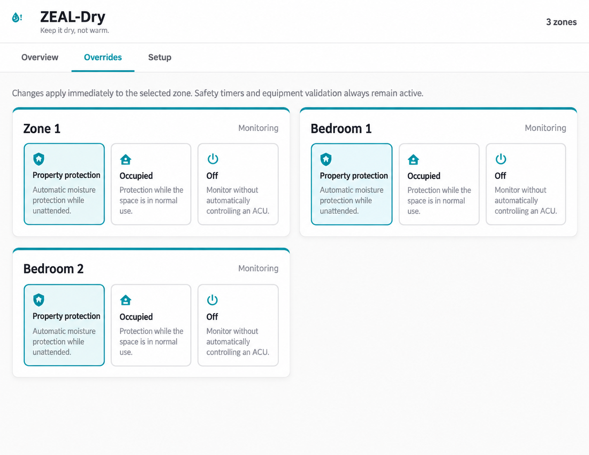
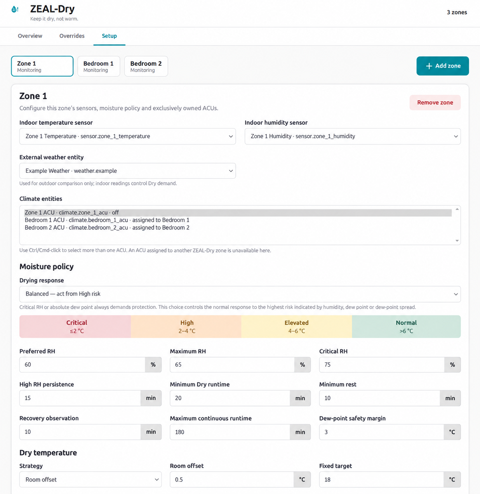

<p align="center">
  
</p>

# ZEAL-Dry

**Intelligent moisture protection for the spaces you leave behind.**

ZEAL-Dry is a Home Assistant custom integration for protecting homes, holiday properties, boats, caravans, cellars, garages and other enclosed spaces from airborne moisture, condensation and mould risk.

> **Keep it dry, not warm.**

## Install with HACS

[](https://my.home-assistant.io/redirect/hacs_repository/?owner=Buster1959&repository=ZEAL-Dry&category=integration)

After installing in HACS:

1. Restart Home Assistant.
2. Go to **Settings → Devices & services → Add Integration**.
3. Search for **ZEAL-Dry**.
4. Create a zone.
5. Choose **Monitoring only**, **Test / Dummy ACU**, or **Live climate control**.
6. Open **ZEAL-Dry** from the Home Assistant sidebar.

The integration options include **Show ZEAL-Dry in the Home Assistant sidebar**.
If the link is hidden, restore it from **Settings → Devices & services →
ZEAL-Dry → Configure**. The panel remains available directly at `/zeal-dry`.

## Web UI

Version 0.3.9 adds a dedicated Home Assistant panel with the focused tabs agreed
for ZEAL-Dry:

- **Overview** — one combined view of every zone, with live moisture risk,
  demand, ACU state, an `HH:MM:SS` Drying runtime and protected-start countdown,
  clickable Home Assistant history, and a six-hour outdoor dew-point outlook.
- **Overrides** — switch each zone independently between Property Protection,
  Occupied and Off profiles from the same page.
- **Setup** — add, edit and remove zones inside the ZEAL-Dry panel. Define each
  independently measured zone with one indoor
  temperature/humidity pair, one or more Dry-capable ACUs, and an optional
  standard Home Assistant weather entity for outdoor dew-point comparison. A
  Drying response selector chooses Early protection, Balanced or Economy while
  preserving critical moisture overrides.

### Three-zone interface

The Overview keeps every zone visible in one combined status view.



Overrides remain independent per zone while being available from the same page.



Administrators can add, select, edit and remove zones from Setup. Equipment
ownership is shown alongside the zone-specific sensors and moisture policy.



Home Assistant entities remain available for dashboards and automations.

## Current development status

Version 0.3.9 implements Blocks 6–7 plus the dedicated Web UI: Dry-capable
multi-ACU control, restart protection, persistent settings, recoverable equipment
availability, and Home Assistant status/control entities. Live operation remains
a controlled prototype and should be tested under supervision on your AC.

Each climate entity can belong to only one ZEAL-Dry zone. Creation,
reconfiguration, panel saves and startup all reject duplicate ACU ownership so
two independent controllers can never command the same equipment.

Required indoor sensors use the same four-hour `last_reported` availability
window as ZEAL-Heat so quiet battery devices are not falsely declared offline.
Battery metadata, associated node/connectivity state and rate-limited Home
Assistant refresh probes for known mains-powered devices provide additional
health evidence. A separate 30-minute confirmation limit prevents an old reading
from starting or continuing energy-consuming Dry operation. One
persistent warning is created after five continuous unhealthy minutes and is
dismissed automatically when the sensor recovers.

The built-in test mode provides adjustable temperature and humidity values plus a dummy ACU so the moisture and dew-point control logic can be exercised without external YAML or real equipment.

## Documentation

- [Wiki — Getting Started](../../wiki/Getting-Started)
- [Wiki — Instructions for Use](../../wiki/Instructions-for-Use)
- [Wiki — Moisture Demand and Protection](../../wiki/Moisture-Demand-and-Protection)
- [Wiki — Troubleshooting](../../wiki/Troubleshooting)
- [Wiki — Documentation Ownership](../../wiki/Documentation-Ownership)

Detailed project documentation is under [`/docs`](docs/), including:

- [Project definition](docs/PROJECT_DEFINITION.md)
- [Condensation risk and Drying response](docs/CONDENSATION_RISK_PROFILES.md)
- [Architecture](docs/ARCHITECTURE.md)
- [Control model](docs/CONTROL_MODEL.md)
- [Entity model](docs/ENTITY_MODEL.md)
- [Development plan](docs/DEVELOPMENT_PLAN.md)
- [UI design](docs/UI_DESIGN.md)
- [Project positioning](docs/PROJECT_POSITIONING.md)
- [Brand assets](docs/brand/README.md)
- [Documentation screenshots](docs/images/README.md)

## Important scope boundary

ZEAL-Dry manages airborne moisture, humidity, condensation and associated mould risk. It does not diagnose or cure rising damp, penetrating damp, plumbing leaks, groundwater ingress or other structural water-entry problems.

## License

MIT License. See [`LICENSE`](LICENSE).

The [wiki](../../wiki) is a separate Git repository. Clone both for complete
offline user and technical documentation:

```bash
git clone https://github.com/Buster1959/ZEAL-Dry.git
git clone https://github.com/Buster1959/ZEAL-Dry.wiki.git
```
