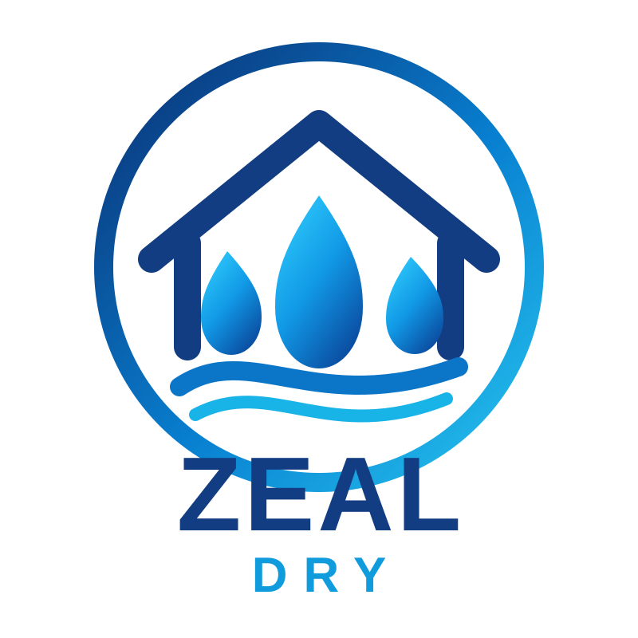

# ZEAL-Dry brand assets

ZEAL-Dry uses the ZEAL family visual language with water droplets replacing the heat motif.

## Primary logo

Use this artwork for documentation, repository branding and future Home Assistant presentation work.

The current mark combines:
- ZEAL family blue palette
- house/protection motif
- water droplets for airborne moisture
- flowing water lines for drying and moisture control
- ZEAL-Dry wordmark
